# RP2024 Digital Signal Generator

A digital signal generator implemented on the **Raspberry Pi Pico**, developed in five different programming approaches to compare polling, interrupts, and programming environments in an embedded system.

The project generates **sine, triangular, sawtooth, and square waveforms**, allowing the user to configure amplitude, DC offset, and frequency through a 4×4 matrix keypad. A dedicated pushbutton is used to change the waveform.

The same general application was implemented using:

* Arduino IDE
* MicroPython
* C with polling
* C with interrupts
* C with polling + interrupts

The project was developed as part of **Digital Electronics Laboratory III** at Universidad de Antioquia.

---

## Overview

The main objective was to develop a functional digital signal generator while comparing different programming approaches for the same embedded application.

The system consists of three main stages:

1. **User interface** — 4×4 keypad and waveform-selection button.
2. **Signal generation** — waveform calculation and timing according to the selected parameters.
3. **Output stage** — conversion of the generated digital values into an analog waveform.

The project was also used to evaluate the practical differences between high-level development environments and lower-level C programming, particularly regarding execution control, input handling, and interrupt management.

---

## Main Features

* Four selectable waveforms:

  * Sine
  * Triangle
  * Sawtooth
  * Square
* Adjustable amplitude
* Adjustable DC offset
* Adjustable frequency
* 4×4 matrix keypad interface
* Dedicated waveform-selection button
* Multiple software implementations
* Polling and interrupt-driven input handling
* Digital-to-analog output stage
* Serial/USB parameter monitoring in the corresponding implementations

---

## Hardware

The project is based on the **Raspberry Pi Pico (RP2040)** and a small external signal-conditioning circuit.

The hardware includes:

* Raspberry Pi Pico
* 4×4 matrix keypad
* Pushbutton
* External 8-bit resistor DAC for the Arduino and most C implementations
* Resistors
* Capacitor
* Operational amplifier
* Signal-conditioning circuitry
* Oscilloscope for waveform verification

### Prototype

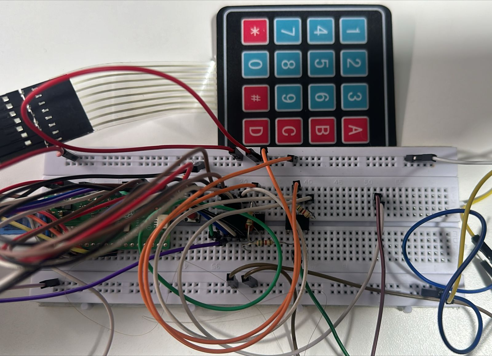

### External DAC IC (not used in this case)

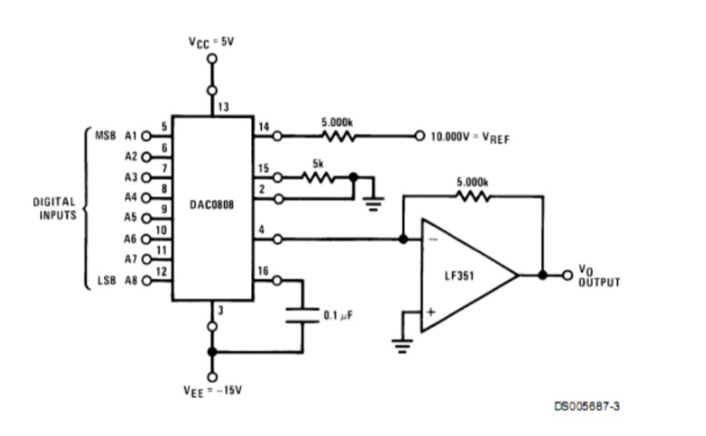

### Simpler 8-bit Resistor DAC (implemented)

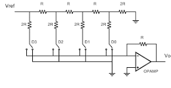

The Arduino, C polling, and C polling + interrupts implementations output an 8-bit digital value through **GP0–GP7**, which is converted into an analog voltage using the external resistor DAC.

The MicroPython implementation uses a different output method: **PWM on GP15**.

The interrupt-driven C implementation also differs from the other variants: its current source defines `DAC_PIN` as GP0 and passes the calculated 8-bit value directly to `gpio_put()`. Therefore, its output implementation should not be considered equivalent to the GP0–GP7 parallel DAC used by the other variants.

---

## Hardware Interface

The main pin configuration used by the Arduino and C implementations is:

| Function        | Raspberry Pi Pico pins |
| --------------- | ---------------------- |
| 8-bit DAC       | GP0–GP7                |
| Waveform button | GP16                   |
| Keypad rows     | GP18–GP21              |
| Keypad columns  | GP22, GP26–GP28        |

The MicroPython implementation uses a different keypad configuration and PWM output:

| Function        | Raspberry Pi Pico pin |
| --------------- | --------------------- |
| PWM output      | GP15                  |
| Waveform button | GP16                  |
| Keypad columns  | GP2–GP5               |
| Keypad rows     | GP6–GP9               |

---

# How It Works

The user configures the signal through the keypad. The program stores the selected waveform and its parameters, then continuously calculates samples according to the selected waveform equation.

A simplified signal-generation pipeline is:

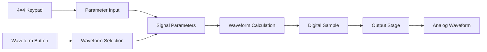

The generated waveform is represented digitally and converted into an output signal through the corresponding hardware interface.

---

## Waveforms

The four supported waveform types are:

### Sine

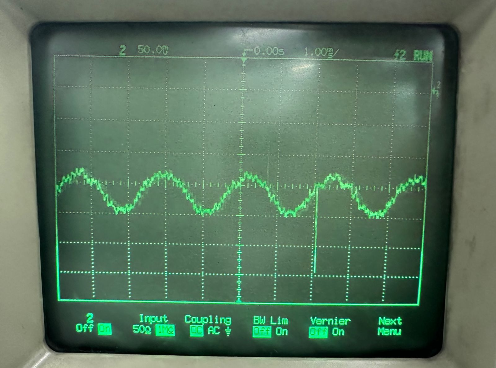

### Triangle


### Sawtooth

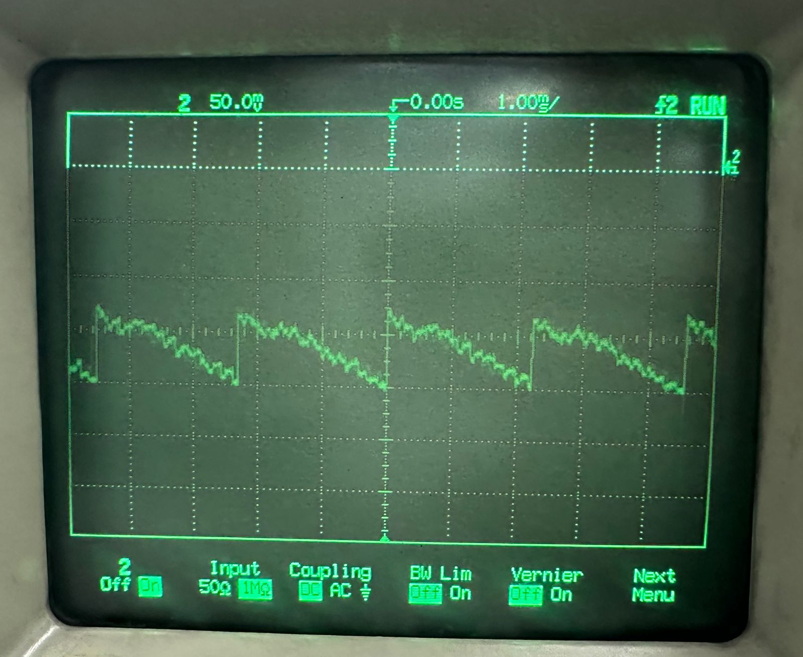

### Square

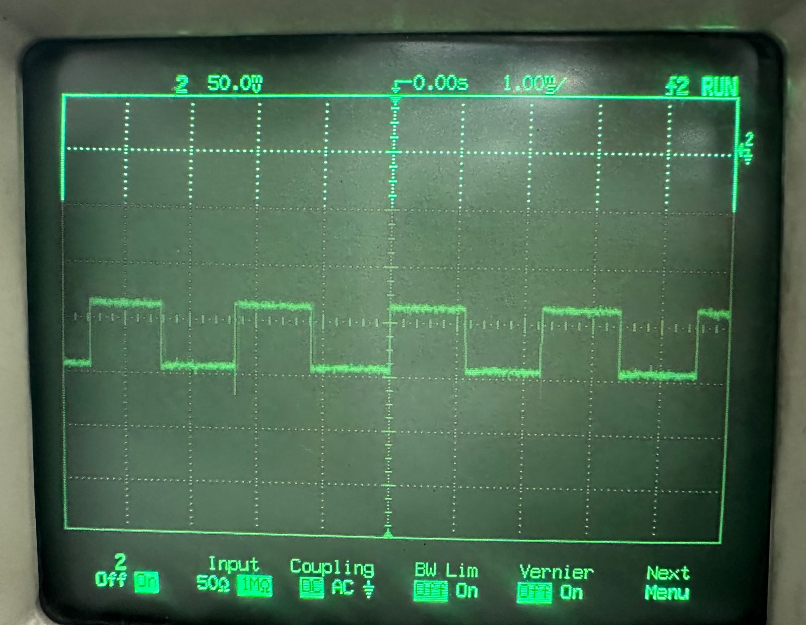

The waveform equations and their implementation vary slightly between programming environments, but all five versions implement the same four fundamental waveform types. In fact, these captures correspond to the Arduino implementation.

---

## User Interface

The 4×4 keypad is used to enter the signal parameters.

The available parameter configuration follows the same general interaction:

* `A` — configure amplitude
* `B` — configure frequency
* `C` — configure DC offset
* `D` — confirm the entered value

The dedicated pushbutton cycles through the available waveform types.

Typical parameter limits implemented by the programs are:

| Parameter |           Range |
| --------- | --------------: |
| Amplitude |     100–2500 mV |
| DC offset |      50–1250 mV |
| Frequency | 1–12,000,000 Hz |

The exact defaults and implementation details vary between versions.

---

# Software Implementations

The project contains five independent implementations of the same general signal-generator application.

Each implementation focuses on a different programming model.

---

## 1. Arduino

**Directory:** `DSG_Arduino/`

The Arduino implementation uses the Arduino environment and a traditional **polling-based architecture**.

The main loop repeatedly:

1. Scans the keypad.
2. Processes parameter input.
3. Checks the waveform-selection button.
4. Calculates the next waveform sample.
5. Sends the sample to the output stage.

### Architecture

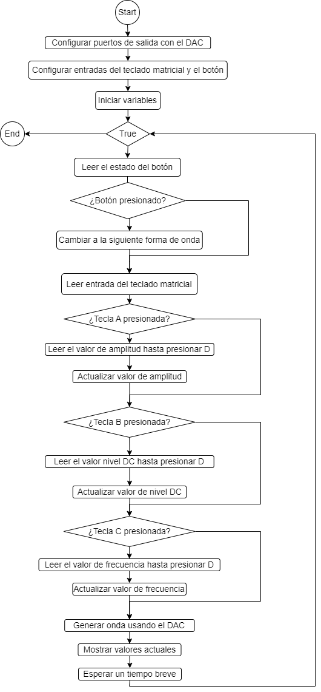

The implementation uses `micros()` for timing and generates approximately ten digital samples per waveform cycle according to the implemented sampling calculation.

The waveform value is scaled to an 8-bit range from `0` to `255` and written to the external DAC through GP0–GP7.

### Default Configuration

* Waveform: sine
* Amplitude: 100 mV
* Frequency: 10 Hz
* DC offset: 50 mV

---

## 2. MicroPython

**Directory:** `DSG_Micropython/`

The MicroPython version was developed using a higher-level programming environment while retaining direct control of the Raspberry Pi Pico peripherals.

Unlike the pure polling implementations, this version combines:

* **Keypad polling**
* **Interrupt-based waveform-button handling**

### Architecture

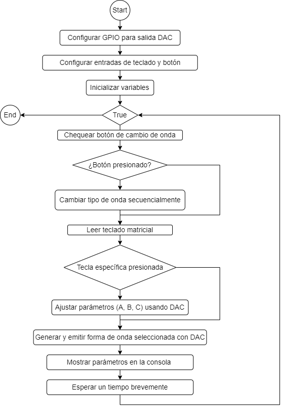

The keypad is scanned periodically while the waveform-selection button is configured with a rising-edge interrupt.

The signal output is generated using **PWM on GP15**, rather than the external 8-bit parallel DAC used by the Arduino and most C versions.

Waveform calculations are performed using MicroPython's mathematical functions, and the PWM duty cycle is adjusted according to the calculated waveform value.

### Default Configuration

* Waveform: sine
* Amplitude: 1000 mV
* Frequency: 10 Hz
* DC offset: 500 mV

---

## 3. C — Polling

**Directory:** `DSG_C_POL/`

This implementation uses the Raspberry Pi Pico SDK and implements the user interface entirely through **polling**.

The main loop continuously handles:

1. Keypad scanning
2. Parameter configuration
3. Waveform-button polling
4. Waveform generation
5. DAC output

### Architecture

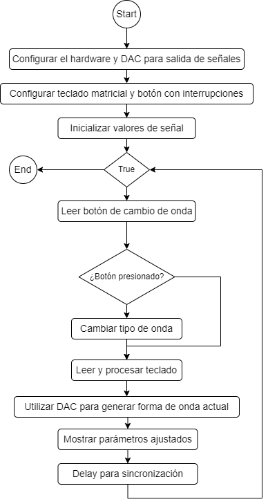

Waveform samples are generated in blocks and converted to an 8-bit value before being written to the external DAC through GP0–GP7.

The implementation uses the Pico SDK's timing functions for sample generation and introduces short delays between samples.

---

## 4. C — Interrupts

**Directory:** `DSG_C_INT/`

This version moves user-input handling into GPIO interrupt callbacks.

The waveform-selection button and keypad inputs are configured to generate GPIO interrupts. The callback identifies the input event and processes the corresponding action.

### Architecture

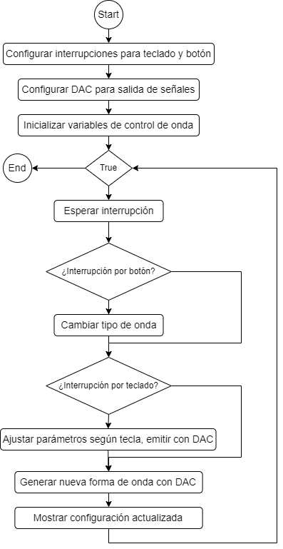

The main loop is therefore simplified to continuously generate the waveform, while user interaction is handled asynchronously.

This implementation demonstrates the increased complexity involved in interrupt-driven embedded programming, particularly with:

* GPIO interrupt configuration
* Debouncing
* Shared state
* `volatile` variables
* Input processing inside callbacks

### Implementation note

The current implementation differs from the other DAC-based C versions. It defines the DAC output around `GP0` and passes an 8-bit value through `gpio_put()`, rather than explicitly writing the eight DAC bits across GP0–GP7.

---

## 5. C — Polling + Interrupts

**Directory:** `DSG_C_INT_POL/`

The final implementation combines both programming approaches.

The intended architecture is:

* **Interrupts** for the waveform-selection button
* **Polling** for the keypad
* Continuous waveform generation in the main loop

### Architecture

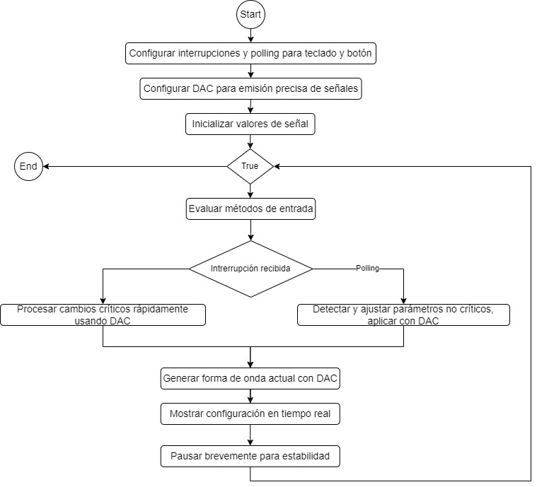

This approach attempts to combine the simpler keypad-management model of polling with the asynchronous response provided by interrupts for the dedicated waveform button.

The implementation also contains a polling check for the waveform button in the main loop in addition to its interrupt callback, so the current source should be regarded as a hybrid implementation rather than a purely interrupt-driven button path.

---

# Implementation Comparison

The five versions provide the same overall application while exposing important differences in software architecture.

| Implementation         | Environment  | Keypad     | Waveform Button           | Output                   |
| ---------------------- | ------------ | ---------- | ------------------------- | ------------------------ |
| Arduino                | Arduino IDE  | Polling    | Polling                   | 8-bit parallel DAC       |
| MicroPython            | MicroPython  | Polling    | Interrupt                 | PWM                      |
| C Polling              | Pico SDK / C | Polling    | Polling                   | 8-bit parallel DAC       |
| C Interrupts           | Pico SDK / C | Interrupts | Interrupt                 | GP0-based implementation |
| C Polling + Interrupts | Pico SDK / C | Polling    | Interrupt + polling check | 8-bit parallel DAC       |

The main educational difference is not the waveform mathematics itself, but **how the processor manages user input and timing while maintaining continuous signal generation**.

---

# Experimental Results

The laboratory work compared the five implementations in terms of development difficulty, execution performance, and resource usage.

The following results correspond to the experimental observations reported during the project.

| Implementation           | Reported difficulty | Reported maximum frequency |
| ------------------------ | ------------------: | -------------------------: |
| Arduino / Polling        |              8 / 10 |                    ~10 kHz |
| MicroPython              |              7 / 10 |                     ~1 kHz |
| C / Polling              |              7 / 10 |                    ~10 kHz |
| C / Interrupts           |              4 / 10 |                    ~10 kHz |
| C / Polling + Interrupts |              3 / 10 |                    ~10 kHz |

The difficulty scale used in the laboratory report ranges from **1 (more difficult)** to **10 (easier)**.

These frequency values are **experimental results from the laboratory implementation**, rather than guaranteed hardware limits. The actual achievable frequency depends on the implementation, waveform calculation, output method, timing strategy, and measurement conditions.

A separate observation from the C polling implementation reached approximately **16 kHz** during waveform visualization.

---

## Reported Program Size and Memory

The laboratory report also recorded the following approximate resource values:

| Implementation           | Reported program size | Estimated RAM |
| ------------------------ | --------------------: | ------------: |
| Arduino / Polling        |                 14 kB |         ~2 kB |
| MicroPython              |                  7 kB |         ~8 kB |
| C / Polling              |               5.99 MB |       ~1.5 kB |
| C / Interrupts           |               6.73 MB |         ~2 kB |
| C / Polling + Interrupts |               7.92 MB |         ~3 kB |

These values are preserved from the laboratory measurements and should **not be interpreted as directly comparable executable-memory footprints** across the different toolchains. Build artifacts, generated files, runtime environments, and measurement methodology differ substantially between Arduino, MicroPython, and the Pico C SDK.

---

# Key Takeaways

The project demonstrated several practical differences between programming approaches for embedded systems.

### Polling

Polling is straightforward to understand and implement. The main loop explicitly checks the state of each input, making the program flow easy to follow.

Its main limitation is that input handling and signal generation share the same execution path.

### Interrupts

Interrupts allow external events to be handled asynchronously, reducing the need for continuous input checking in the main loop.

However, this approach introduces additional complexity related to:

* Interrupt configuration
* Debouncing
* Shared variables
* Callback execution
* Synchronization between the interrupt handler and the main program

### Hybrid Approach

Combining polling and interrupts provides a compromise between the simplicity of polling and the responsiveness of interrupt-driven events.

In this project, the hybrid C implementation was also the most complex from a development perspective, illustrating that combining programming models requires careful control of program state and event handling.

### High-Level vs. Low-Level Environments

Arduino and MicroPython simplify peripheral configuration and application development, while C with the Pico SDK provides more explicit control over the RP2040 hardware.

MicroPython offered the simplest high-level development experience but showed lower experimental maximum frequency in the laboratory implementation.

C required more development effort, particularly for interrupt-based architectures, but provided greater control over GPIO handling and timing.

---

# Repository Structure

```text
RP2024-Digital-Signal-Generator/
│
├── DSG_Arduino/
│   ├── GDSv14.ino
│   └── doc/
│
├── DSG_Micropython/
│   ├── GDS_Micropython.py
│   ├── Doxyfile
│   ├── doxygen_log.txt
│   └── Salida/
│
├── DSG_C_POL/
│   ├── main.c
│   ├── CMakeLists.txt
│   ├── pico_sdk_import.cmake
│   ├── build/
│   ├── .vscode/
│   └── doc/
│
├── DSG_C_INT/
│   ├── main.c
│   ├── CMakeLists.txt
│   ├── pico_sdk_import.cmake
│   ├── build/
│   ├── .vscode/
│   ├── doc/
│   └── doc_doxy/
│
├── DSG_C_INT_POL/
│   ├── main.c
│   ├── CMakeLists.txt
│   ├── pico_sdk_import.cmake
│   ├── build/
│   ├── .vscode/
│   └── doc/
│
├── flowcharts/
│   ├── Arduino.png
│   ├── C_Interrupt.png
│   ├── C_Polling.png
│   ├── C_polling_interrupt.png
│   └── MicroPython.png
│
├── media/
│   ├── DAC_resistors.png
│   ├── protoboard.jpeg
│   ├── sawtooth.jpeg
│   ├── schematic.jpeg
│   ├── sine.jpeg
│   ├── square.jpeg
│   └── triangular.jpeg
│
├── .gitignore
├── LICENSE
└── README.md
```

---

# Documentation

Each implementation contains its own source code and, where applicable, generated documentation.

The `flowcharts/` directory contains the high-level execution flow of each programming approach, while `media/` contains the hardware and waveform images used throughout this README.

The complete laboratory analysis, theoretical background, implementation discussion, and experimental comparison are documented in the corresponding laboratory report.

---

# References

The project was developed within the context of Digital Electronics Laboratory III and was supported by the following references:

* Monk, S. — *Programming Arduino: Getting Started with Sketches*, 2nd Edition.
* Mazidi, M. A. et al. — *The AVR Microcontroller and Embedded Systems: Using Assembly and C*.
* Horowitz, P. & Hill, W. — *The Art of Electronics*, 3rd Edition.
* Williams, T. — *The Circuit Designer's Companion*.
* Catsoulis, J. — *Designing Embedded Hardware*.

---

# License

This project is distributed under the **MIT License**.

See the [LICENSE](LICENSE) file for the complete license text.
